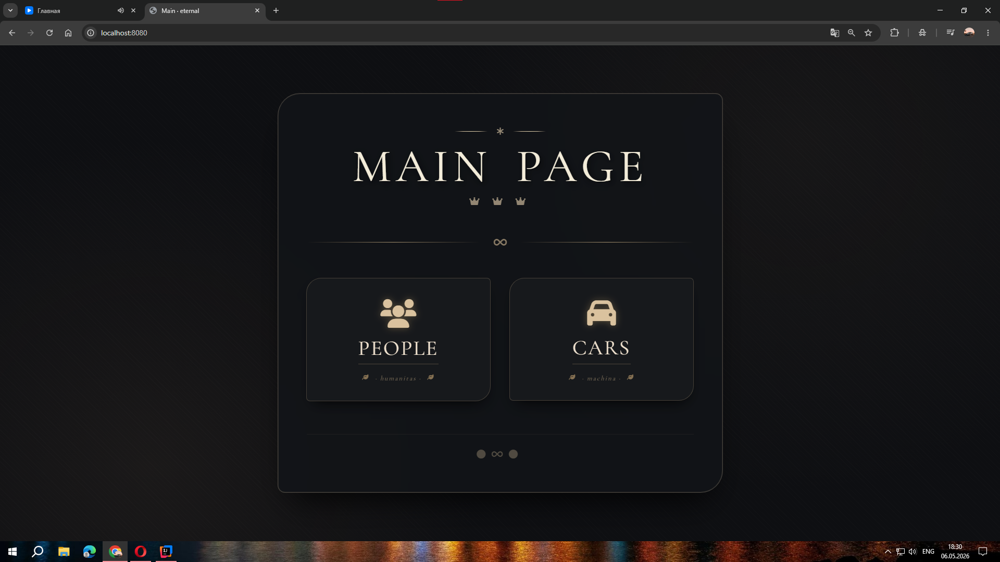
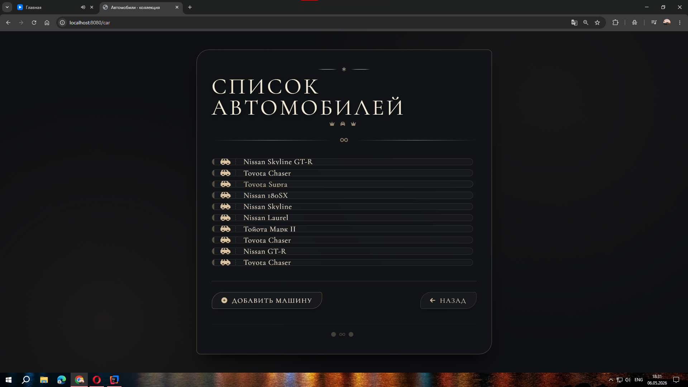
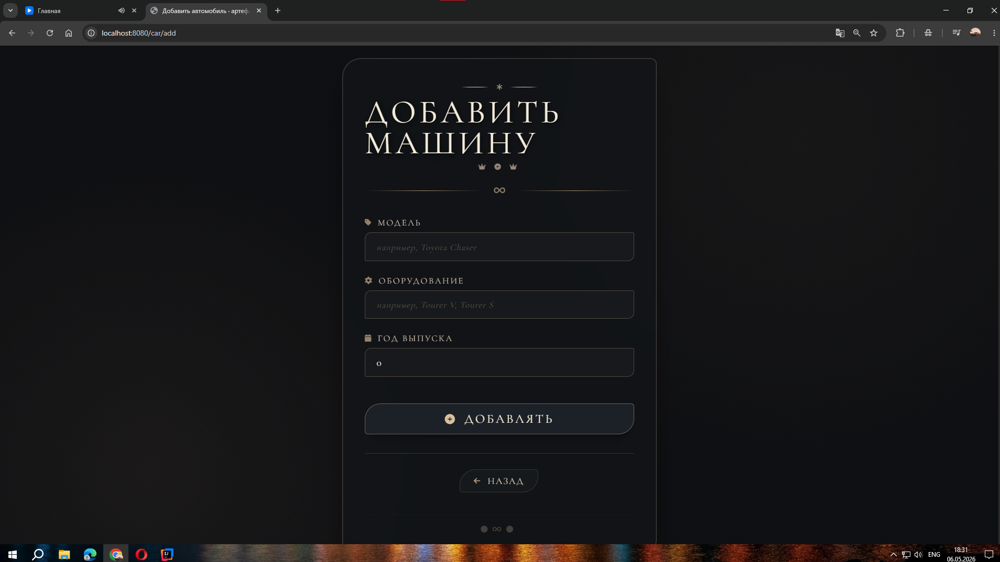
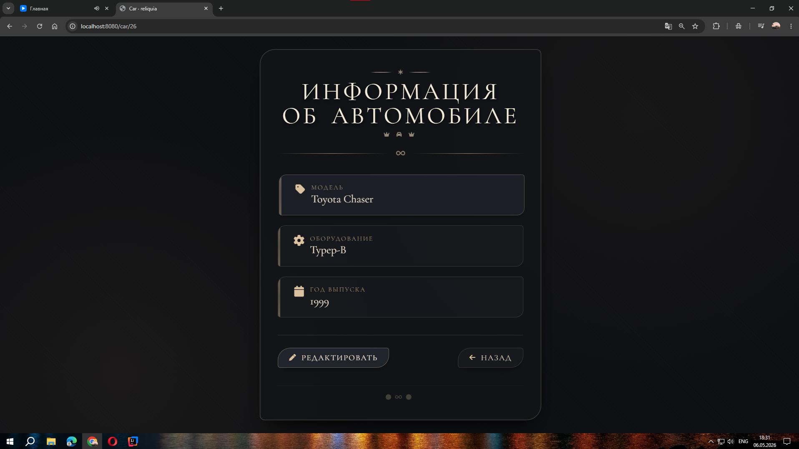
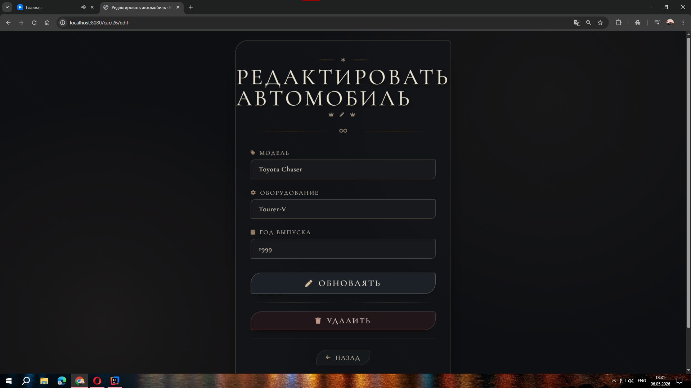
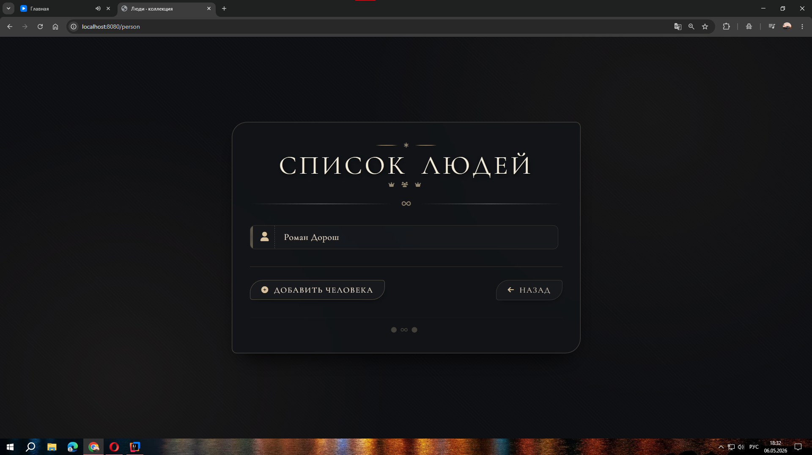
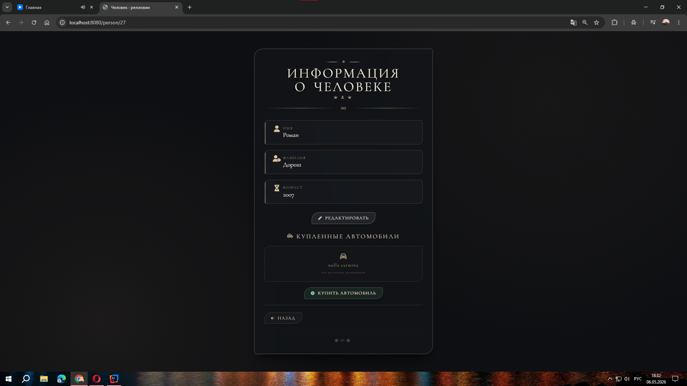
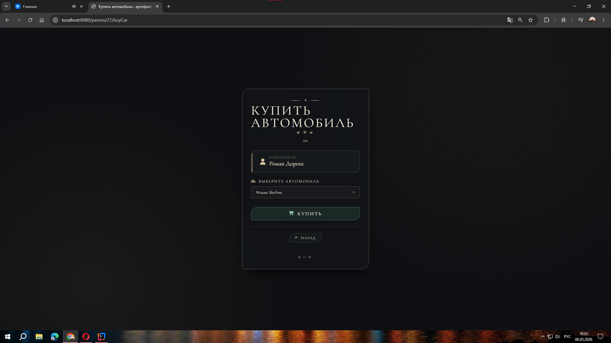
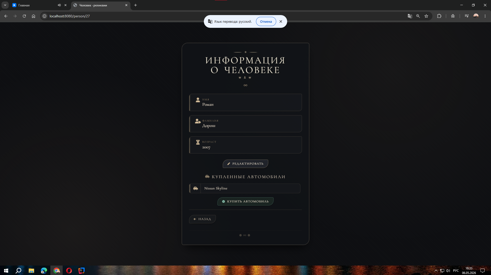

# JapaneseHut — Покупка/Продажа Авто (Проект на Spring Boot)

---

## Описание Проекта

Приложение для управления покупкой/продажей автомобилей с демонстрацией связи **One-to-Many** между пользователями и
машинами.

---

## Возможности

- **CRUD операции** для Пользователей и Автомобилей.
- **Связь One-to-Many**: Пользователь может владеть несколькими машинами.
- **Покупка/Продажа**: Пользователь может покупать и продавать машины, после того, как машина была куплена она перестает
  отображаться в списке доступных машин для покупки
- **Ручная привязка**: Быстрая покупка/продажа по ID через веб-интерфейс.

---

## Технологии

- Java-17
- Spring Boot
- Spring Web
- Spring Data Jpa
- PostgreSQL
- Thymeleaf

---

## Скриншоты

> 
> 
> 
> 
> 
> 
> 
> 
> 

---

## Как запустить

1. **Клонировать репозиторий**:
   ```bash
   git clone https://github.com/Roman-Dorosh/JapaneseHut.git
   ```
2. Настроить PostgreSQL:

- Создать базу данных: CREATE DATABASE Carsharing;
- В файле src/main/resources/application.properties указать:
    - spring.datasource.url=jdbc:postgresql://localhost:5432/Carsharing
    - spring.datasource.username=postgres
    - spring.datasource.password=твой_пароль

3. Выполнить sql:

- Код находится в папке IDEA Project\Carsharing\src\main\resources\sql

4. Запуск приложения:

- Открыть класс CarsharingApplication и запустить main метод

5. Открыть в браузере: http://localhost:8080

---

## Идеи для улучшения

- Реализовать авторизацию пользователей (Spring Security).
- Добавить валидацию данных.

--- 

## 🎌 Автор 🎌

Roman Dorosh — GitHub https://github.com/Roman-Dorosh